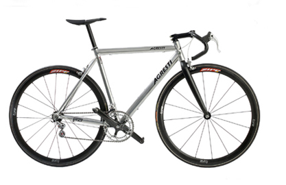
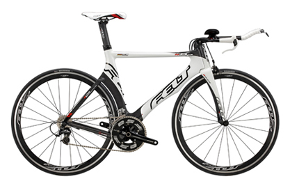

jQuery Simple Image Gallery
===========================

Installation
============

* Clone the git repo - `git clone https://github.com/fernando-dev/simplegallery.git` - or [download it](https://github.com/fernando-dev/simplegallery/archive/master.zip)
* includes `simplegallery.js` between `<head>` and `</head>`

Demo
====
* [demo](http://demo.nandomoreira.me/simplegallery/)

Usage
=====

+ *include layer script*

```
jQuery(document).ready(function($) {
	$('#gallery').simplegallery();
});
```


+ *Add HTML*

```
<section id="gallery">
	<div class="gall-content">
	    
	    
	    
	    
	</div>

	<div class="clear"></div>

	<div class="gall-thumbnail">
	    <div class="thumb">
	        <a href="#" rel="1">
	            
	        </a>
	    </div>
	    <div class="thumb">
	        <a href="#" rel="2">
	            
	        </a>
	    </div>
	    <div class="thumb">
	        <a href="#" rel="3">
	            
	        </a>
	    </div>
	    <div class="thumb last">
	        <a href="#" rel="4">
	            
	        </a>
	    </div>
	</div>
</section>
```

Options
=======

+ `galltime` - fade transition speed
+ `gallcontent` - class attribute of the Images Content
+ `gallthumbnail` - class attribute of the Thumbnails Content
+ `gallthumb` - class attribute of the Thumbnails

+ Enjoy!

Contributors
============
 * [Fernando Moreira](http://nandomoreira.me/) - Creator and Maintainer
 * [You!)](https://github.com/) - Your Name Here. simply contribute to the project ;)


Contact
=======

If you have any questions or find any bugs, let me know.

f@nandomoreira.me
